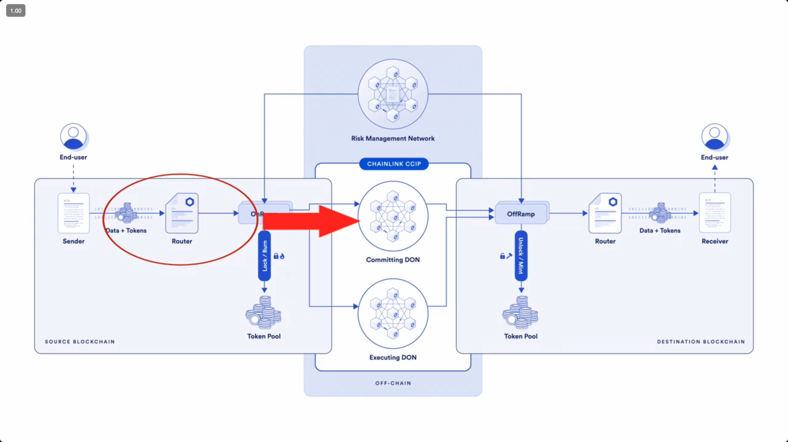

## 2. ERC-721 NFT

Storing decentralized content
- IPFS directly
  - you have an option to rely on a centralized web server to access it.
- Using Pinata.cloud

- you can convert and svg image xml to a base64 encoding with `base64`

  ```bash
  base64 -i ./example.svg

  PHN2ZyB4bWxucz0iaHR0cDovL3d3dy53My5vcmcvMjAwMC9zdmciIHdpZHRoPSI1MDAiIGhlaWdodD0iNTAwIj4KICA8dGV4dCB4PSIyMDAiIHk9IjI1MCIgZmlsbD0iYmxhY2siPgogICAgSGkhIFlvdSBkZWNvZGVkIHRoaXMheyIgIn0KICA8L3RleHQ+Cjwvc3ZnPgo=
  ```

- Now the data is:
  ```
  data:image/svg+xml;base64,PHN2ZyB4bWxucz0iaHR0cDovL3d3dy53My5vcmcvMjAwMC9zdmciIHdpZHRoPSI1MDAiIGhlaWdodD0iNTAwIj4KICA8dGV4dCB4PSIyMDAiIHk9IjI1MCIgZmlsbD0iYmxhY2siPgogICAgSGkhIFlvdSBkZWNvZGVkIHRoaXMheyIgIn0KICA8L3RleHQ+Cjwvc3ZnPgo=
  ```

- happy face base64 encoding
  ```
  data:image/svg+xml;base64,PHN2ZwogIHZpZXdCb3g9IjAgMCAyMDAgMjAwIgogIHdpZHRoPSI0MDAiCiAgaGVpZ2h0PSI0MDAiCiAgeG1sbnM9Imh0dHA6Ly93d3cudzMub3JnLzIwMDAvc3ZnIgo+CiAgPGNpcmNsZQogICAgY3g9Ijk2IgogICAgY3k9IjEwMCIKICAgIGZpbGw9InllbGxvdyIKICAgIHI9Ijc4IgogICAgc3Ryb2tlPSJibGFjayIKICAgIHN0cm9rZS13aWR0aD0iMyIKICAvPgogIDxnIGNsYXNzPSJleWVzIj4KICAgIDxjaXJjbGUgY3g9IjYxIiBjeT0iODIiIHI9IjEyIiAvPgogICAgPGNpcmNsZSBjeD0iMTI3IiBjeT0iODIiIHI9IjEyIiAvPgogIDwvZz4KICA8cGF0aAogICAgZD0ibTEzNi44MSAxMTYuNTNjLjY5IDI2LjE3LTY0LjExIDQyLTgxLjUyLS43MyIKICAgIHN0eWxlPSJmaWxsOm5vbmU7IHN0cm9rZTogYmxhY2s7IHN0cm9rZS13aWR0aDogMzsiCiAgLz4KPC9zdmc+Cg==
  ```

- low-level `call`, this is for transaction that change the state
- `staticcall`, this is for view or pure function.

## 3. Defi protocol

- AAVE, Compound - they are all lending protocol
- Uniswap - it is DEX

- On the commenting standard NATSPEC!
- Check-Effect-Interaction
  - Effect is updating the internal application states
  - interaction is calling external address or transferring value/tokens

- fuzz testing and stateful fuzz testing

- todo: actually good to follow doing section 3

- there is a `bound()` function that kind of like doing modulo on the size of valid input.

### On invariant testing

What `runs` and `depth` actually mean

From the invariant docs:
- `runs`: how many independent random sequences to try.
- `depth`: how many function calls are executed in each sequence (each run).

After every single call, all `invariant_*` functions are executed and must hold.

So one “campaign” is:

  For run in 1..runs:
    For step in 1..depth:
      - Pick a random target function (among all exposed via targetContract / targetSelector).
      - Fuzz its arguments.
      - Call it.
      - Immediately run that particular invariant function chosen in the campaign and check assertions.
    Move on to the next run, starting from the same initial setUp() state (i.e. each run starts fresh).

If a call reverts, the depth counter still increments, and invariants are still checked afterwards (unless fail_on_revert = true, in which case the test fails on the revert itself).

## 4. Cross Chain Rebase Token

- rebase token: token that the balance change overtime. The `balanceOf()` function is actually dynamically computed, with say interest accrued over time.

### Bridges

- bridge is mostly on asset transfer
- There is a broader topic on this, called cross-chain messaging
- bridge mechanics (4 categories):
  - burn/lock and mint/unlock (burn on src chain, mint on dest chain) - your bridge need to have permission to burn and mint token

real-world bridge application
- Transoirter: built on top of chainlink CCIP
- warmhole portal
- layerzero

### chainlink CCIP

- Overall architecture
  

- there is a Commit DON (distributed oracle network - on src chain) that listen to the on-chain activity, and Executing DON (on destination chain)

- There is a Risk Management network (RMN) that monitor CCIP activity for anomalies

### CCT Architecture
- there is also a cross-chain token standard (CCT).

- chainlink has the CCT standard architecture. The core components are:
  1. The **Token** contract - the ERC20 token
  2. The **TokenPool** contract - deployed on the src and destination chain. It control the burn/lock, mint/unlock mechanism.
  3. The **TokenAdminRegistry** contract - deployed by chainlink on supported chains. A registry mapping token address to the administrators
  4. **RegistryModuleOwnerCustom** contract - additional hooks, plugin logics for TokenAdminRegistry.

### Circle CCTP
- USDC also has something called cross-chain transfer protocol, using the burn and mint mechanism. No wrapped tokens around, and have better token liquidity across all chains.

### Solidity: Stack Too Deep error
- When EVM hits a contract, it has a few spaces
  - bytecode (deployed bytecode on the address)
    - pointed to by program counter
  - calldata (input)
  - stack (empty)
  - memory (temporary storage)
  - storage (persist across txs)

- The EVM stack space
  - It has 1024 items, but you can only access the top 16 items at any point.
  - No way to access the 17th one or below, without moving the above items into memory.

- One solution is to use the `via-ir` flag, the diagram describe it:
  - https://www.soliditylang.org/blog/2024/07/12/a-closer-look-at-via-ir/
  - It optimizes the code, and do spilling (offloading stack var to memory)
  - but the optimization might cause changes in storage slot (really??)

- Another solution is using [solx](https://solx.zksync.io/)
  - pros
    - it automatically apply spilling if necessary
    - is designed to optimize code without altering the execution order or logic
    - shorter compiled bytecode, and more gas efficient
  - cons
    - no recursion
    - If inline assembly exists, it will disable spilling

## 5. Airdrop, Merkle Tree, ECDSA Signature, EIP-4844 blob fee & Tx 4

- the original data is hashed twice to form the leaf nodes in the merkle tree.
  - hash twice to make the leaf hash structurally different from an internal node hash. `leaf = H(H(data))`, while internal node is `H( left || right)`.
  - this could achieve the same result. Separating leaf hash as `H(0x00 || data` and internal node as `H(0x01 || left_hash || right_hash)`

- So your intuition is correct: the Merkle construction assumes there is a canonical, ordered list of recipients somewhere. A claimer’s proof is always derived from that list; the only question is whether they compute it themselves (with the full list) or let a service compute it and rely on public auditability.
  - either the airdrop program release the full `(address, amount)` list so users' frontend can withdraw this list and compute the proof in frontend.
  - or the airdrop program has a backend, that once the user connects with it via a wallet, could compute and return the merkle proof to the user who then submit it on-chain.

- **EIP-191** established a foundational standard for formatting signed data in Ethereum, ensuring signed messages are distinct from transactions. Building upon this, **EIP-712** revolutionized how structured data is handled for signing, introducing human-readable formats in wallets and, critically, strong replay protection mechanisms through the domainSeparator and hashStruct concepts.

- The transaction type in Ethereum
  - ref: https://updraft.cyfrin.io/courses/advanced-foundry/merkle-airdrop/transaction-types
  - Transaction Type 0 (legacy transaction) - user
  - Transaction Type 1 (Optional Access list / 0x01 / EIP-2930)
  - Transaction Type 2 (EIP-1559) - it has revamp on its fee market
    - has a `baseFee` and `maxPriorityFeePerGas`.
  - Transaction Type 3 (blob transaction / EIP-4844 / Proto-danksharding) - for blob, defining the blob gas fee.

In zkSync
  - transaction type 113 (EIP-712 Transaction) - typed structure data hashing and signing for zkSync
  - transaction type 255 (priority transactions) - enabling the sending transaction directly from L1 to zkSync L2 network. L1 initiate action, and the L2 listen and execute upon it.

## 6. Upgradeabke Smart Contracts

The proxy pattern
- proxy contract: contains the contract state/storage
- implementation contract: contains the biz logics

The proxy contract uses low level `delegatecall()`

Possible issues in proxy pattern

- storage clashes
  The Golden Rule of Proxy Storage: When upgrading, you can only append new state variables. You must never reorder, remove, or change the type of existing state variables.

- function selector clashes

Common Proxy pattern and solutions

1. Transparent Proxy Pattern: This pattern solves function selector clashes by adding routing logic to the proxy. It inspects the address of the caller (msg.sender). If the caller is the designated admin, the call is handled by the proxy's own logic.

2. UUPS (Universal Upgradeable Proxy standard - EIP-1822): moves the upgrade logic itself out of the proxy and into the implementation contract. This makes the proxy contract smaller, cheaper to deploy, and more universal.

3. Diamond Proxy pattern (EIP-2535): This is a highly advanced, modular pattern. Instead of pointing to a single implementation, a Diamond proxy can delegate calls to multiple implementation contracts, known as "facets." A central mapping within the proxy routes each function selector to its corresponding facet.

### UUPS Contract
- you need to call `disableInitializers()` in constructors for the proxy. Since you need to wait for the implementation contract to be deployed and then initialize with the impl contract.

### Exercises

EIP-1967: define in the proxy contract which storage slot it stores the implementation contract address.

## 7. Account Abstraction

zksync and Ethereum are quite different in Account abstraction

For zksync, aa is supported natively onchain. And there are a lot of system level smart contract for zkSync.

For zksync, the transaction txType = 113 (0x71)

There is a bootLoader: this is a system level smart contract that orchestrate valdiation and execution. During valdation, the msg.sender is from this BootLoader smart contract.

There is a NonceHolder contract - managing all account nonce. You need to interact with NonceHolder contract to correctly update the account nonce.

This is the way to increment nonce for zkSync contract

### On validateTransaction

Core responsibility of validateTransaction

1. Nonce Management

    ```sol
    // Call nonceholder
    // increment nonce
    // call(x, y, z) -> system contract call
    SystemContractsCaller.systemCallWithPropagatedRevert(
        uint32(gasleft()), // gas limit for the call
        address(NONCE_HOLDER_SYSTEM_CONTRACT), // Address of the system contract
        0, // value to send (must be 0 for system calls)
        abi.encodeCall(INonceHolder.incrementMinNonceIfEquals, (_transaction.nonce)) // Encoded function call data
    );
    ```
2. Fee checking

    ```sol
    // Check for fee to pay
    uint256 totalRequiredBalance = _transaction.totalRequiredBalance(); // Uses MemoryTransactionHelper
    if (totalRequiredBalance > address(this).balance) {
        revert ZkMinimalAccount__NotEnoughBalance(); // Custom error
    }
    ```

3. Signature validation

    ```sol
    // Check the signature
    bytes32 txHash = _transaction.encodeHash(); // Get the hash based on tx type (helper)

    // Note: The step MessageHashUtils.toEthSignedMessageHash(txHash) is NOT needed here
    // for zkSync AA transactions using the standard EIP-712 flow as _transaction.encodeHash()
    // already produces the EIP-712 compliant hash.

    address signer = ECDSA.recover(txHash, _transaction.signature); // Recover signer directly from txHash
    bool isValidSigner = signer == owner(); // Check if signer is the contract owner
    ```

4. At the end, it should return a four bytes magic value

### On executeTransaction

1. retrieve the target address, value, calldata
2. It may call system contract, such as `DEPLOYER_SYSTEM_CONTRACT` for contract deployments.
   Otherwise, make normal external call via Yul.

### On fee payment

Within your account contract, two primary functions are designated for handling fee payments:
- `payForTransaction`: This function is invoked when the account itself is directly paying the transaction fees.
- `prepareForPaymaster`: This function is called if a paymaster is sponsoring the transaction. It handles the initial interaction and setup required for the paymaster flow.

you need to make payment to the bootloader in `payForTransaction()`.

## 8. DAOs

## 9. Smart Contract Audit

- https://rekt.news/solv-rekt
- check this hack: https://x.com/DefimonAlerts/status/2029593179863883873
- https://codehawks.cyfrin.io/c/2026-03-nft-dealers

The audit toolkit:
- manual review
- test suites
- static analysis
  - [slither](https://github.com/crytic/slither)
- fuzz testing / stateful fuzz testing
- formal verification

- time bound yourself

Testing layer
- layer 1: unit testing (also called dynamic analysis)
- layer 2: fuzz testing (also called dynamic analysis)
- layer 3: static analysis (looking at a problem, or using tool like slither)
- layer 4: formal verification
  - symbolic execution
  - abstract interpretation
  - solidity has a built-in tool for formal verification

To protect yourself, run unknown code in isolated dev environment (docker)

### To further learn more
- sigma prime blogpost: https://blog.sigmaprime.io/solidity-security.html
- damn vulnerable defi: https://www.damnvulnerabledefi.xyz/
- ethernaut
- solodit: https://solodit.xyz/
- updraft security & auditing course: https://updraft.cyfrin.io/courses/security
- rekt.news: https://rekt.news/
- codehawks platform: https://codehawks.cyfrin.io/
