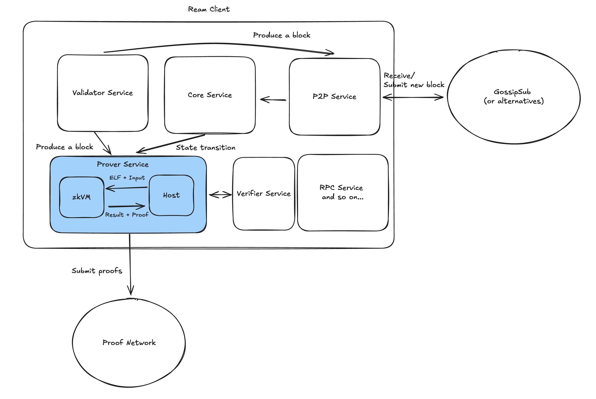

# Interested tasks

## Grandine: zkVMs for Beacon Chain Snarkification
https://github.com/eth-protocol-fellows/cohort-six/blob/master/projects/project-ideas.md#grandine-zkvms-for-beacon-chain-snarkification

By Saulius Grigaitis

We are experimenting with zkVMs (zero-knowledge virtual machines) to enable SNARK-based proving of the Beacon Chain’s state transition function. Initial results using SP1 and RISC Zero show promise for networks with tens of thousands of validators. We now propose to scale this work to support larger validator sets and to explore new zkVMs — such as OpenVM and Zisk — that offer continuation supports.

## Ream Client - A Beam client in Rust: Benchmark zkVM performance on Ream's Beacon state transition functions

https://github.com/eth-protocol-fellows/cohort-six/blob/master/projects/project-ideas.md#ream-client---a-beam-client-in-rust-benchmark-zkvm-performance-on-reams-beacon-state-transition-functions

By Unnawut

We've started benchmarking SP1 and RISC Zero against ream's consensus codebase, giving us early data on performance and how different zkVMs behave when running consensus logic. This lets us track performance regressions as we iterate on the codebase and pinpoint the specific roadblocks and bottlenecks that arise when running consensus specs inside zkVM environments.

We are looking to extend our benchmarking setup to cover other zkVMs like OpenVM, Zisk, Jolt, Brevis Pico, Valida, etc. You'll be implementing benchmarks for these systems, modifying the ream codebase as needed to support the snarkification, while keeping the benchmark framework modular enough to keep track of differences across code iterations, and to easily convert for beam chain specs down the road.

We hope this project provides essential data for making informed zkVM choices in Beam Chain development. For the fellow, it's a chance to get hands-on with both beacon chain consensus implementation details and the rapidly evolving zkVM ecosystem, and prepare yourself to snarkify the upcoming Beam Chain specs.

- Lodestar: ERA file support
  https://github.com/ChainSafe/lodestar/issues/7048

- Teku / Nimbus / Grandine: Implement EIP-7917 - Deterministic proposer lookahead
  [EIP-7917](https://eips.ethereum.org/EIPS/eip-7917) is a mechanism to pre-calculate and store a deterministic proposer lookahead in the beacon state at the start of every epoch. Implementing this EIP in one or more of the above mentioned clients is a low hanging-fruit as well as [super valuable](https://hackmd.io/@linoscope/eip-7917-from-preconf-protocol), and may serve as an excellent starting point for a fellow to get involved with core protocol work.

  By Justin Drake & Lin Oshitani

- Grandine: Exploring Distributed Validator Technology (DVT) Compatibility
  By Saulius Grigaitis

  Distributed Validator Technology (DVT) is gaining momentum within the Ethereum staking ecosystem. We propose to assess Grandine’s compatibility with major DVT solutions, evaluate integration challenges, and explore potential extensions to support secure, decentralized validator operations.

- Grandine: ePBS (EIP-7732)
  By Saulius Grigaitis

  Grandine currently has no implementation of EIP-7732: Enshrined Proposer-Builder Separation (ePBS).

- Ephemery testnet
  By Mario Havel

# Weekly Study

## Week 3 - Cannes week

- https://efdn.notion.site/EPF6-EthCC-in-Cannes-208d9895554180c09da2e5c1f70e1b09#208d98955541819e8eded62554f61628

## Week 5
standup
  - todo: need to submit a project proposal to decide to work on. Draft a proposal, and find a mentor to work with you on the zkVM benchmarking.

- The dev notes around zkvm in ream are all in https://hackmd.io/@reamlabs

### Message from Ream team Unnawut & related learning

- There are 2 PoC codebases for zkvm in ream: SP1 (https://github.com/ReamLabs/consensp1us) and RiscZero (https://github.com/ReamLabs/consenzero-bench).

- If you have to pick one I'd suggest looking at https://github.com/ReamLabs/consenzero-bench as its got a bit more implementations to it

- We don't really have a common benchmark framework across zkvms but a contributor was suggesting ere framework (https://github.com/ReamLabs/ream-study-group/issues/47). Not a benchmark framework but zkvm adapters that could be useful

The few zkVM:
- r0 zkVM and SP1 are the most mature (2)
- remaining: OpenVM, Pico, zkEngine, Zisk, zkMIPS, zkWASM (6 more)

ssz = simple serialize

#### sp1-project-template

flow:
- build
- execute: ensure your program run properly
- prove

RUST_LOG=info <release-binary> --prove

- three type of proof systems
  - its own core
  - Groth16
  - Plonk

- There is an SP1 prover network
- observation: you can't run PLONK locally. It maybe due to OOM issue when proving with PLONK in docker

#### consens1us

## Week 6
- reamlabs study note: https://hackmd.io/@reamlabs
- Jun Song study note: https://hackmd.io/@junsong

- there is a simpleserialize website for serializing/deserializing ssz object
  https://github.com/ChainSafe/ssz/tree/master/packages/simpleserialize.com

# Info
- start at June 16, 2025, count as wk 1
- currently (Jul 14) in epf-6: week 4 / week 5
- standup call: every Monday @2300 HKT, https://meet.ethereum.org/epf-standup
- OH call: every Wed @2300 HKT, https://meet.ethereum.org/epf-office-hours
- EF org chart: https://ethereum.foundation/assets/ef-org-chart.png
- Mario & Joshua Davis: they are protocol team: Protocol & Application Support

## ream

https://github.com/ReamLabs/ream
https://ream.rs/
