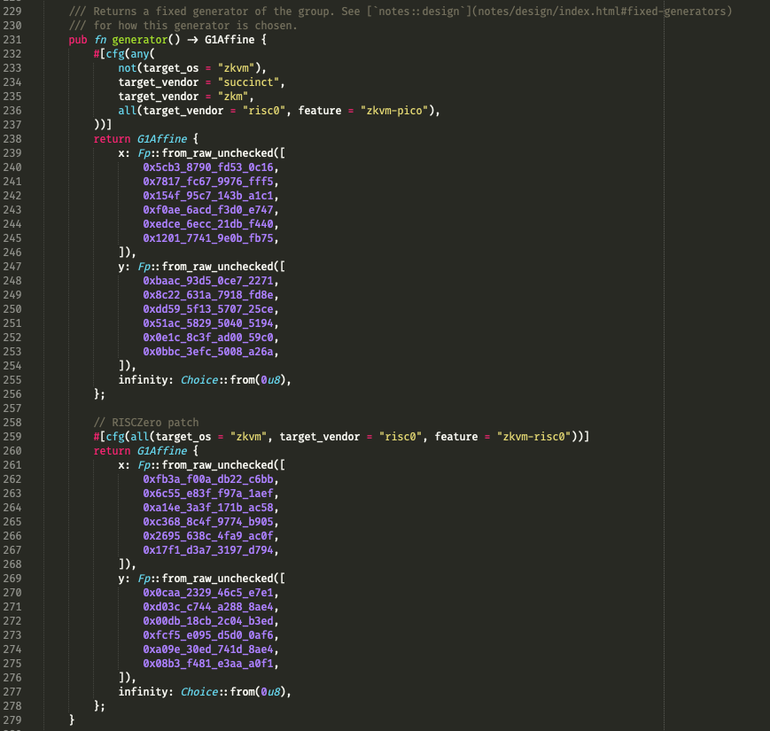
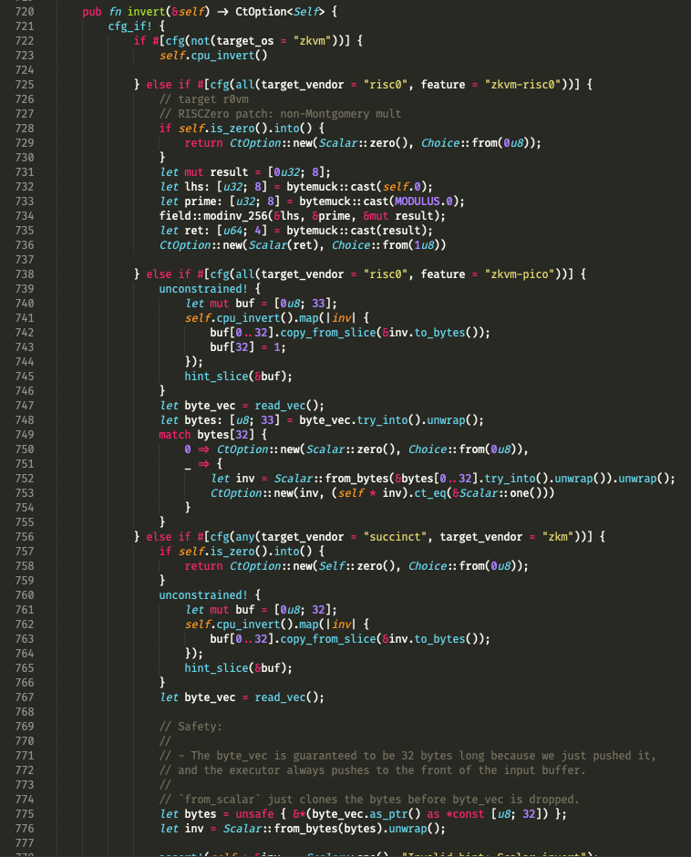

# Report: Brevis Pico zkVM Integration & Benchmarking of the Block State Transition Function in zkVM for Grandine

## Project Abstract

Grandine is a fast and lightweight Ethereum consensus client written in Rust. As Ethereum explores using zkVMs to generate proofs for block state transitions instead of relying on recomputation, the Grandine team has developed an extension framework that enables easy integration and benchmarking of any zkVM’s state transition function (STF). The extension framework can be found in Grandine’s main repository under the [`zkvm` directory](https://github.com/grandinetech/grandine/tree/develop/zkvm).

The framework currently supports integrations with RiscZero [**r0vm**](https://github.com/grandinetech/grandine/tree/develop/zkvm/guest/risc0) and Succinct [**SP1**](https://github.com/grandinetech/grandine/tree/develop/zkvm/guest/sp1) zkVMs, and is designed for extensibility to additional zkVMs.

Each fellow participated in this project was assigned a zkVM integration:

- [me](https://github.com/jimmychu0807): [Brevis Pico](https://docs.brevis.network/)
- [Ritesh](https://github.com/Dyslex7c): [ZKM Ziren](https://www.zkm.io/ziren)
- [Aman](https://github.com/0xprivateChaos): [Zisk](https://0xpolygonhermez.github.io/zisk/introduction.html)

The original project proposal can be [referenced here](https://github.com/eth-protocol-fellows/cohort-six/blob/master/projects/grandine_beacon_zkVMs_snarkification.md). This report details the integration of Brevis Pico zkVM, key refactoring for modularity, adding a new test case, and proof generation attempts on both local CPUs and GPUs via the Bonsai Network.

This report is accompanied with a [project presentation](https://docs.google.com/presentation/d/1a1n-GMzIe9ALcUcrq4O_Tme6zmKSvh-lfnIxbqo7l5o/edit?usp=sharing).

## Detail Work & Final State

### Host and Guest Code Overview

The integration is completed in [grandinetech/grandine PR #386](https://github.com/grandinetech/grandine/pull/386). The framework consists of host and guest code sections.

The [host code](https://github.com/grandinetech/grandine/blob/develop/zkvm/host/src/main.rs):

- Based on the test case selected from cli arguments, retrieves four input parameters:
  1. Chain/phase config
  2. Signed beacon block in [SSZ format](https://www.ssz.dev/active)
  3. Beacon state in SSZ format
  4. A public key cache

- Executes the state transition function and records the new state root for comparison against zkVM output.

- Initializes the zkVM runtime, passing in the four inputs for computation.

- Compares the zkVM-derived state root with the host computation.

The [guest code](https://github.com/grandinetech/grandine/tree/develop/zkvm/guest) is implemented for each zkVM and provides:

- Parsing and deserialization of input parameters from the host.

- Execution of state transition and calculation of the new state root (with or without proof generation, depending on the mode).

- Returning results and, if applicable, the proof back to the host.

There are two modes for guest execution: **execute** (computation only) and **prove** (computation plus zk-proof generation). Execute mode acts as a sanity check, while prove mode is the focus for benchmarking but is much more time-intensive.

### Grandine PR #386

Work described here is comprised in [grandinetech/grandine PR #386](https://github.com/grandinetech/grandine/pull/386).

The `zkvm/host/backend.rs` was refactored for modularity, separating implementations for each zkVM (e.g., [risc0](https://github.com/grandinetech/grandine/pull/386/files#diff-43126fe75df96cea60b7e30fcd691a2892e10809631d94259cc48252208216ef), [sp1](https://github.com/grandinetech/grandine/pull/386/files#diff-4a3e27d25c765c36ddf6df426ce49e0ab5472665c14217248cd7ed385a82a2ae)), and a new [Pico host implementation](https://github.com/grandinetech/grandine/pull/386/files#diff-1d8fb10e7eb152891f7c37b4a249dc4092ff33434189694ee7aee7d77cfa5a9e) was added, following the established trait-based API pattern.

A [helper build script](https://github.com/grandinetech/grandine/pull/386/files#diff-2015ba7f1b0aad9904659f52f2844d91f022c63a2b10db135b2332668943a4a0) is added to automate building both host and guest code in a bundle. Since Pico requires the nightly Rust toolchain, all Pico-related build commands must use the nightly prefix (e.g., `cargo +nightly-2025-08-04 ...`).

The [Pico guest code](https://github.com/grandinetech/grandine/pull/386/files#diff-b622fd118817f3bd6bf7b754cca00afa983d87cc40544a6d0cfd144fe7548529) mirrors other integrations, using Pico’s specific APIs.

Additionally, the CI workflow [`zkvm-test.yml`](https://github.com/grandinetech/grandine/pull/386/files#diff-3100b4a9081a2d21a9a64759e0d35e33684fac9cb222c56d8c00135f23beaed6) was introduced to test and validate builds for different zkVMs, serving as a continual integration sanity check.

### SHA2 and BLS12-381 Customization

The state transition function relies heavily on SHA256 and BLS12-381 cryptography. Each zkVM necessitates optimizations for these operations, prompting custom tweaks in Grandine’s [sha-256](https://github.com/grandinetech/universal-precompiles/tree/RustCrypto-hashes/sha2-v0.10.9) and [bls12-381](https://github.com/grandinetech/universal-precompiles/tree/zkcrypto/bls12_381-6bb9695) precompile libraries.

Supporting Brevis Pico required patches:

- sha-256: [grandinetech/universal-precompiles PR #3](https://github.com/grandinetech/universal-precompiles/pull/3)
- bls12-381: [grandinetech/universal-precompiles PR #4](https://github.com/grandinetech/universal-precompiles/pull/4)

The BLS12-381 changes were notably intricate, with over 25 customizations for different zkVM targets. Here is a taste:

For [**G1Affine** generator function](https://github.com/grandinetech/universal-precompiles/blob/dfe056b1cde164284237b53abc0ffc903a2247a1/src/g1.rs#L231-L279).

For the [**Scalar** invert operation](https://github.com/grandinetech/universal-precompiles/blob/dfe056b1cde164284237b53abc0ffc903a2247a1/src/scalar.rs#L720-L782).

Brevis Pico also have a `target_vendor` string of **risc0**, which is the same as r0vm. To distinguish Pico from r0vm, an additional feature flag (**zkvm-pico**) was added, alongside **zkvm-risc0**.

This is reflected in:

- bls-crypto [`cargo.toml`](https://github.com/grandinetech/grandine/pull/386/files#diff-b9a966a6766d089f8f3954f894313fd1f550d596d3e5d2ecacf8f895fcd89c74)
- sha-256 [`cargo.toml`](https://github.com/grandinetech/universal-precompiles/pull/3/files#diff-704ad48075ec95eb928ef5912af78756de25009feefecbc6b18e2d0bc5c20a48)
- bls12-381 [`cargo.toml`](https://github.com/grandinetech/universal-precompiles/pull/4/files#diff-2e9d962a08321605940b5a657135052fbcef87b5e360662bb527c96d9a615542)

### Benchmark Results

Responding to my request, Grandine team added an empty block transition test coming from the [consensus-spec-test](https://github.com/ethereum/consensus-spec-tests/tree/master/tests/mainnet/electra/sanity/blocks/pyspec_tests/empty_block_transition), raising the test suite to four cases (ranked below by computational cost):

1. Empty block transition test (`empty-block-transition`)
2. Pectra Devnet without epoch transition (`pectra-wo-epoch`)
3. Pectra Devnet with epoch transition (`pectra-w-epoch`)
4. Mainnet without epoch transition (`mainnet-wo-epoch`)

Benchmarking was run informally on a Macbook Air M1 2020, 16GB RAM.

**r0vm (execute mode)**:

| Case | Time | Execution Cycles |
| ----- | ---------| -------------------------|
| empty-block-transition | 5.59s  | 241,696,768 |
| pectra-wo-epoch | 117.43s  | 4,909,432,832 |
| pectra-w-epoch | 927.43s  | 39,038,484,480 |
| mainnet-wo-epoch | 3066.35s  | 116,489,453,568 |

**Pico (execute mode)**:

| Case | Time | Execution Cycles |
| ----- | ---------| -------------------------|
| empty-block-transition | 33.62s  | 164,850,074 |
| pectra-wo-epoch | 528.43s  | 2,555,459,575 |
| pectra-w-epoch | 2592.21s  | 12,685,893,340 |
| mainnet-wo-epoch | Panicked with max memory exceeded ([explanation](https://github.com/brevis-network/pico/issues/48#issuecomment-3286930946)) | n.a. |

Now we are really interested in running the test cases with proof generated. Unfortunately this takes a huge amount of time. Even the simplest test case takes 3 hours onward to run and I had to terminate the test mid-way.

At the end, I was able to get a hand on running proving test on RiscZero [Bonsai Network](https://dev.risczero.com/litepaper) with GPU capability, thank to another protocol fellow [Subhasish](https://github.com/Subhasish-Behera) who passed the API key to me.

**r0vm (prove mode on Bonsai Network)**:

| Case | Time |
| ----- | ---------|
| empty-block-transition | 58.12s |
| pectra-wo-epoch | 469.90s |
| pectra-w-epoch | error out |
| mainnet-wo-epoch | error out |

Two test cases errored due to exceeding compute quotas. Proof generation for test cases remains very time-consuming, and more powerful GPU hardware is necessary for meaningful benchmarks.

## Project Impact and Future Work

This integration is one part of Grandine’s broader zkVM initiative, with other fellows working on Ziren and Zisk. Significant progress was made, yet full benchmarking in prove mode was limited by available hardware. Future work will require access to large GPU clusters to properly evaluate zkVM performance for state transition proofs.

There is also interest in emerging proving networks, such as [Boundless Network](https://boundless.network/) and [SP1 Prover Network](https://explorer.succinct.xyz/provers), which now incentivize proof generation by community provers via network tokens. Grandine could explore outsourcing proof generation to these services.

## Self-Evaluation

Participating in the Ethereum Protocol Fellowship and zkVM integration has deepened my understanding of Ethereum client testing strategies and the importance of unified test suites across diverse client implementations. Tools like EF’s [consensus-specs](https://github.com/ethereum/consensus-specs), [consensus-spec-tests](https://github.com/ethereum/consensus-spec-tests), [execution-spec-tests](https://github.com/ethereum/execution-spec-tests), and Kurtosis [Ethereum Package](https://github.com/ethpandaops/ethereum-package) exemplify best practices for common test cases and APIs.

This work clarified challenges around scalable proof generation and the goal of sub-12 second proofs for practical Ethereum mainnet use.

Gratitude goes to the Ethereum Foundation, especially [Mario](https://github.com/taxmeifyoucan) and [Josh](https://github.com/joshdavislight), for running the amazing fellowship cohort, and the Grandine team, especially [Saulius](https://github.com/sauliusgrigaitis), [Artiom](https://github.com/artiomTr), and [Povilas](https://github.com/povi), for mentorship and feedback on code contributions. The collaborative effort within EPF allows me to learn from other fellows about other facets of Ethereum development, notably FOCIL, PeerDAS, and SSZ optimization.

I plan to continue my work in the field of [programmable cryptography](https://0xparc.org/blog/programmable-cryptography-1), advancing privacy and improving user experience for blockchain users.
